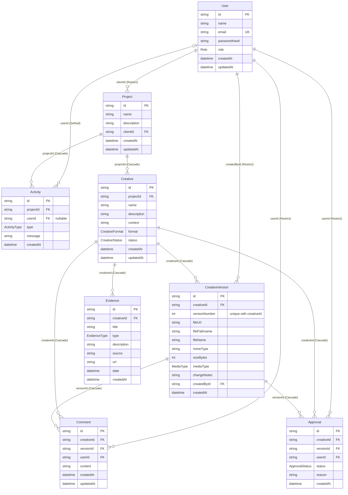
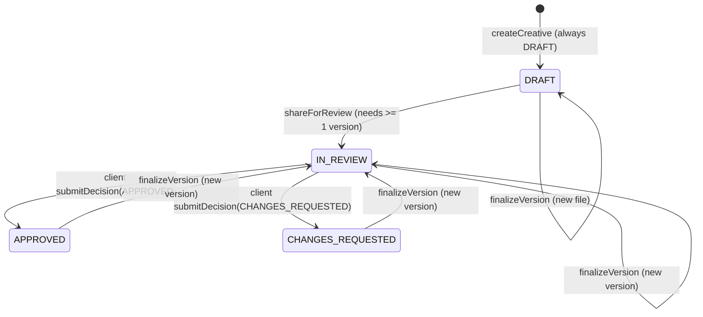

# Clyntique — Database Architecture (as implemented)

Source of truth: `prisma/schema.prisma` (read directly). Provider: PostgreSQL via `@prisma/adapter-pg` (`src/lib/prisma.ts`), Prisma 7.10.0, client generated to `src/generated/prisma` (git-ignored, regenerated by `postinstall` and `npm run build`). Hosted database: Render (Ohio), one database, one `DATABASE_URL` for all environments seen. Connection details are deliberately not recorded here.

Schema is managed with `prisma db push`. **There is no `prisma/migrations/` directory**, so there is no migration history (see GAPS-D2).

Live row counts (read-only query during this audit): 2 users, 2 projects, 2 creatives, 0 versions, 0 evidence, 0 comments, 0 approvals, 3 activity rows. (Phase 4 tests were run on a temporary creative that was deleted afterwards.)

## ER diagram

## Enums

| Enum | Values | Used by | Notes |
|---|---|---|---|
| `Role` | TEAM, CLIENT | `User.role`, JWT payload | Only two roles. |
| `CreativeStatus` | DRAFT, IN_REVIEW, CHANGES_REQUESTED, APPROVED, ARCHIVED | `Creative.status` | `ARCHIVED` has a badge style and guards, but no code path sets it (see below). |
| `CreativeFormat` | STORY, FEED, STATIC, VIDEO | `Creative.format` | Placement; drives preview aspect ratio. Independent of the uploaded file's `MediaType` (a VIDEO-format creative can hold an image file, and vice versa; not validated). |
| `MediaType` | IMAGE, VIDEO | `CreativeVersion.mediaType` | Derived server-side from file extension. |
| `EvidenceType` | RESEARCH, STATISTIC, COMPETITOR, CUSTOMER_INSIGHT, SOURCE, OTHER | `Evidence.type` | Labels in `src/components/review/evidence-types.ts`. |
| `ApprovalStatus` | APPROVED, CHANGES_REQUESTED | `Approval.status` | Client decisions only. |
| `ActivityType` | CREATIVE_UPLOADED, VERSION_UPLOADED, FEEDBACK_RECEIVED, CHANGES_REQUESTED, CREATIVE_APPROVED, OTHER | `Activity.type` | See activity table below; `CREATIVE_UPLOADED` is used for "shared for review", not for uploads. |

## Models, relationships and delete behaviour

| Model | Purpose in code | Key constraints | Delete rules |
|---|---|---|---|
| `User` | Login identity and role. | `email` unique. `passwordHash` (bcrypt, 12 rounds) is never selected by `getCurrentUser` (`src/lib/auth/dal.ts`); only `login` in `src/app/auth/actions.ts` reads it. | Referenced with `Restrict` by Project, CreativeVersion, Comment, Approval; `SetNull` for Activity. Users cannot be deleted while they have records. No user deletion feature exists. |
| `Project` | One campaign for exactly one client. | `clientId` (single client user). Index on `clientId`. | Cascades to Creative and Activity. No delete feature exists. |
| `Creative` | One ad creative inside a project. | Index on `projectId`. | Cascades to versions, evidence, comments, approvals. No delete feature exists. |
| `CreativeVersion` | One uploaded file (or, for legacy rows, just a URL). | `@@unique([creativeId, versionNumber])`. `fileUrl` is required (non-null); all other file fields are nullable. | Cascade from Creative. Blob files are **not** removed when rows cascade (no delete feature, so not currently reachable). |
| `Evidence` | Supporting context for a creative (not per version). | Index on `creativeId`. | Cascade from Creative. |
| `Comment` | Feedback on one version. | Requires `creativeId`, `versionId`, `userId`. No check that `versionId` belongs to `creativeId` at DB level (enforced in `addComment`). | Cascade from Creative and Version. |
| `Approval` | A client decision on one version. | No uniqueness: one-decision-per-version is enforced only by the conditional update in `submitDecision`. | Cascade from Creative and Version. |
| `Activity` | Project timeline entries. | Index on `(projectId, createdAt)`. `message` is free text with names baked in at write time. | Cascade from Project; `userId` set null on user delete. |

## Roles and permission rules (as coded)

Roles come from `User.role`, re-read from the database on every protected request by `getCurrentUser` (`src/lib/auth/dal.ts`). The JWT also carries a role, used only by `src/proxy.ts` for optimistic redirects.

| Rule | Where enforced |
|---|---|
| TEAM sees every project, creative and activity row. There is no per-team-member or per-organisation scoping. | `projectScope` / `creativeScope` in `src/lib/data/workspace.ts` |
| CLIENT sees only projects where `Project.clientId = user.id`. | `projectScope` |
| CLIENT never sees `DRAFT` creatives (lists, counts, detail page, media route). | `creativeScope`, used by `getCreatives`, `getCreativeStatusCounts`, `findAccessibleCreative`, `findAccessibleVersion`, `getCreativeReview`, and the `creatives` filter inside `projectSelect` |
| CLIENT can see `ARCHIVED` creatives (scope only excludes DRAFT); no code can archive one. | `creativeScope` |
| Only TEAM can create projects/creatives, upload, share, edit details, manage evidence. | `requireRole("TEAM")` in `createProject`, `createCreative`; `signedIn("TEAM")` in `finalizeVersion`, `shareForReview`, `updateCreativeDetails`, `saveEvidence`, `deleteEvidence`; role check in `/api/creatives/upload` |
| Only CLIENT can approve or request changes, and only on their own project's non-draft creative. | `signedIn("CLIENT")` + `creativeScope` + `project: { clientId: user.id }` inside the atomic update in `submitDecision` |
| Both roles can comment on any creative they can access (including previous versions). | `addComment` |
| Nobody can edit or delete comments. | No such code |

## Project ownership and client assignment

- A project has exactly one client (`Project.clientId`), chosen from existing `CLIENT` users in `createProject` (`src/app/admin/projects/actions.ts`). There is no organisation model; "client" is a person (the demo client is "Alex Morgan").
- Reassigning a project, adding a second client user to a project, or creating client accounts is not implemented. Accounts exist only via `prisma/seed.ts` (refuses `NODE_ENV=production`).

## Creative lifecycle (implemented state machine)

- Not reachable by any code: back to `DRAFT` after sharing, any transition to or from `ARCHIVED`, a client changing an already-recorded decision on the same version.
- Transitions are enforced in application code only (`src/lib/review/actions.ts`); the database has no constraint or trigger on `Creative.status`.
- Legacy state: the Phase 3 creative "Instagram Story — Product Launch" is `IN_REVIEW` with **0 versions** (created before uploads existed). `shareForReview` cannot be used on it (not DRAFT); a TEAM upload of V1 fixes it.

## Versions and approvals

- `versionNumber` is assigned inside a transaction as `max + 1` (`finalizeVersion`), protected by the `(creativeId, versionNumber)` unique constraint with up to 3 retries on `P2002`. Retried uploads are idempotent by `fileUrl`.
- An `Approval` row records `{creativeId, versionId, userId, status, reason?, createdAt}`. Approvals are never updated or deleted; a new version leaves them attached to the version they were made on. The creative's `status` (not the approval rows) is what says whether the current version is approved.
- `reason` is required (≥ 10 chars) only for `CHANGES_REQUESTED`, enforced in `submitDecision` (not in the database).
- Evidence belongs to the creative as a whole, not to a version (no historical record of evidence per version). Comments belong to a version.

## Evidence / claims

- `Evidence` exists and is fully wired (create, edit, delete by TEAM; read by both roles).
- **There is no claim, finding, or issue model.** Nothing links evidence to a specific comment, decision, claim in the creative, or to a client response. The word "claims" does not appear in the schema or code.

## Activity records written by code

| Event | Type used | Written by | Written for drafts? |
|---|---|---|---|
| Project created | OTHER | `createProject` | n/a |
| Creative shared for review | CREATIVE_UPLOADED | `shareForReview` | n/a (status becomes IN_REVIEW) |
| New version on a shared creative | VERSION_UPLOADED | `finalizeVersion` | No (skipped while DRAFT) |
| Evidence added | OTHER | `saveEvidence` (create only; edit/delete write none) | No |
| Client comment | FEEDBACK_RECEIVED | `addComment` | No |
| Team comment | OTHER | `addComment` | No |
| Approved | CREATIVE_APPROVED | `submitDecision` | n/a |
| Changes requested | CHANGES_REQUESTED | `submitDecision` | n/a |
| Creating a draft creative, editing details, deleting evidence | — | none | — |

Activity is read with `getActivity` (scoped by `projectScope` only; draft-safety relies on activity simply never being written for drafts).

## Fields and values that exist but are not used

| Item | Observation |
|---|---|
| `CreativeStatus.ARCHIVED` | Has a badge style, copy text and is accepted by guards, but no code sets it. |
| `Comment.updatedAt` | Auto-updated column; comments cannot be edited, so it always equals `createdAt`. |
| `User.createdAt/updatedAt`, `Project.updatedAt` | Not displayed. `Project.updatedAt` is used in `toProjectSummary` for last-activity. |
| `Evidence.createdAt` | Used only for ordering. |
| `CreativeVersion.fileUrl` required but `filePathname` duplicates path information | `filePathname` is stored but never read by application code (the media route reads via `fileUrl`). |
| `CreativeVersion.fileName` | Stored and displayed; not used in storage paths (by design). |
| `src/components/ui/divider.tsx` | UI component with no importers (dead code). |
| `ActivityType.OTHER` | Used as a catch-all for project creation, evidence and team replies. |
