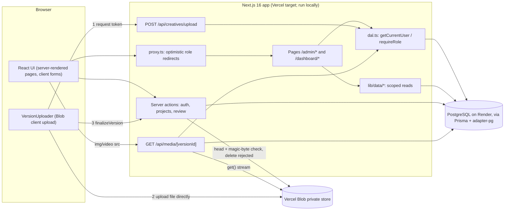

# Clyntique — Implementation Audit (Phases 1–4)

Audit date: 2026-10-09. Project: `D:\clyntique-demo\clyntique`. Method: read the source files, ran lint, type check, production build and Prisma validation, and made read-only database queries. No application code, schema or data was changed by this audit; the only files added are the five documents in this folder. No Git command was run (history was read from `.git/logs/HEAD` as plain text).

Companion documents:
- [CLYNTIQUE_CURRENT_WORKFLOWS.md](CLYNTIQUE_CURRENT_WORKFLOWS.md): what clients and team can actually do today.
- [CLYNTIQUE_FEATURE_INVENTORY.md](CLYNTIQUE_FEATURE_INVENTORY.md): feature table and page-by-page inventory.
- [CLYNTIQUE_DATABASE_ARCHITECTURE.md](CLYNTIQUE_DATABASE_ARCHITECTURE.md): models, ER diagram, permissions, lifecycle, unused fields.
- [CLYNTIQUE_GAPS_AND_RISKS.md](CLYNTIQUE_GAPS_AND_RISKS.md): security findings, defects, incomplete items, dependencies, product questions.

## 1. Executive summary

Clyntique is a Next.js 16 / React 19 / Prisma 7 / PostgreSQL application, about 5,400 lines of hand-written TypeScript, with one shared shell and two role areas: `/admin` (TEAM) and `/dashboard` (CLIENT). Everything shown in the UI comes from the database; no mock data remains.

**What works (verified in a browser against the real database):** sign-in and role routing; team and client dashboards; project creation and client assignment; draft creative creation; evidence and campaign context; sharing a draft; per-version comments; client approve and request-changes with a guarded, version-tied decision; automatic return to review when a new version arrives; stale-version protection; activity records; draft invisibility for clients.

**What is unverified:** the file upload and delivery path (private Vercel Blob). No Blob credentials existed in this environment, so real upload, image preview, video playback, rejection of bad files and the orphan-cleanup script have never run. Versions were exercised using test rows inserted directly into the database.

**The product today is a review loop with a narrow client role.** Clients can comment, approve or request changes. They cannot create, upload, submit evidence or respond to findings; there is no claim/finding concept at all; there are no notifications.

**Top findings** (details and evidence in the Gaps document):
1. **S1 (High if publicly deployed):** documented demo passwords work against the Render database the app uses.
2. **S7 / C1 (Medium):** the upload security design is untested against a real store.
3. **D1 (Medium):** no migration history; schema changes were applied with `db push` to the single remote database.
4. **D2 (Medium):** no way to create accounts outside the dev seed (which refuses production).
5. **B1 (Medium):** an `IN_REVIEW` creative with no file exists in the database.
6. **S2/S3 (Medium):** no login rate limit; no global security headers.
7. No automated tests; no deployment configuration in the repo.

No cross-client data exposure was found in the code. Cross-client denial could not be tested because only one client account exists.

## 2. What was inspected

All of `src/` (pages, components, actions, route handlers, data modules, proxy), `prisma/` (schema, seed, db-check, blob-orphans), `package.json`, `next.config.ts`, `prisma.config.ts`, `tsconfig.json`, `eslint.config.mjs`, `.gitignore`, `.env.example` (names only), `README.md`, `AGENTS.md`, the Phase 2 and Phase 3 reports in `D:\clyntique-demo`, and `.git/logs/HEAD`/`.git/config` as text (remote URL not recorded here). Phase 1A/1B reports referred to in the thread were **not** found on this machine, so Phase 1 is described only from code.

## 3. Phase-by-phase history

"Verified" means I confirmed it in the current code; "claimed" means it comes from a report only.

| Phase | What was built (verified in code) | Claimed but not verifiable | Planned but not built |
|---|---|---|---|
| **1A: Foundation** | Next.js app, TypeScript strict, Tailwind 4, ESLint, Prisma 7 with PostgreSQL adapter (`prisma.config.ts`, `src/lib/prisma.ts`), `.env.example`, `.gitignore`. | Report content, initial commit. | — |
| **1B: Database + auth** | Full schema (User, Project, Creative, CreativeVersion, Evidence, Comment, Approval, Activity and enums), bcrypt passwords, signed JWT cookie sessions (`src/lib/auth/*`), `proxy.ts`, login/logout actions, DAL with `requireUser/requireRole`, dev seed with two demo users, `db-check.ts`. | Report and commit IDs. | Org model, signup/invites, password reset: not present. |
| **2: Design system + shell** | Tokens in `globals.css`; `ui/` components (Button, Input/Field/Textarea/Select, Card, Badge, StatusBadge, Avatar, Divider, ReviewProgress, states, icons); `AppShell`, nav, page header, brand; role-specific dashboard, projects, creatives and activity pages. Phase 2 originally used static demo data in `src/lib/demo-data.ts`. | Phase 2 report says that file existed and "New project" was disabled. | — |
| **3: Real projects + creatives** | `src/lib/data/workspace.ts` (all scoped reads), `createProject`/`createCreative` actions, project detail and creation pages, `Creative.format` column, not-found pages; demo data deleted. Verified: no demo-data file or imports remain. | Report's Render `sslmode=require` workaround for `db push`; browser results. | File upload, evidence, versions, comments, approvals (explicitly deferred). |
| **4: Review workflow** | Review pages for both roles; `src/lib/review/*` (access, actions, blob), `src/lib/data/review.ts`, `src/lib/media.ts`; `/api/creatives/upload`, `/api/media/[versionId]`; additive schema fields (`MediaType`, `Creative.context`, version file metadata and `changeNotes`, `Evidence.url`, `Approval.reason`); `createCreative` changed to draft-only plus campaign context; thumbnails and links on creative cards; orphan script; README/env documentation. | Upload/preview behaviour (unverified), described in `phase-4-report.md`. | No tests were added (none infrastructure exists). |

**Git history caveat:** the working tree's reflog shows only "Initial Clyntique demo" and "feat: real projects and creative management". The commit hashes in the earlier phase reports do not appear, and the Phase 3 report itself says the history was replaced. Whether Phase 4 is committed is unknown to this audit.

## 4. Current architecture

- **Auth:** HS256 JWT in an httpOnly cookie (`SESSION_SECRET`); role/user re-read from PostgreSQL per request.
- **Storage:** nothing stored in PostgreSQL except metadata; files in a private Blob store reachable only through the media route or the SDK. The Blob side is unverified.
- **No** separate backend, queue, cache layer, email service, WebSocket, or analytics.

## 5. Code-level security review: summary

Full table is in the Gaps document (S1–S12). Positive findings confirmed by reading code: no `dangerouslySetInnerHTML`; passwords hashed with bcrypt and never selected into UI objects; all mutations authorize on the server; ids from the browser are only lookup keys inside scoped queries; decisions use a single atomic guarded update; evidence links are scheme-validated. Weak points: S1, S2, S3, S7 above, and the absence of tests.

## 6. Items I could not verify

- Real file upload, preview, video playback and Range streaming; Blob token enforcement of size/type/path; `blob:orphans`.
- Whether a Vercel project or a public deployment exists; production environment variables.
- Cross-client isolation with two client accounts.
- Edit/delete of evidence and `updateCreativeDetails` in a browser.
- Phase 1 reports and whether Phase 4 is committed.
- Accessibility (keyboard and screen-reader) and mobile layout of Phase 4 pages.
- Reachability of the `npm audit` advisories.

## 7. Test and verification report

All run on 2026-10-09 in `D:\clyntique-demo\clyntique`. No database writes, migrations or deletions were performed.

| Check | Command | Result |
|---|---|---|
| Lint | `npm run lint` | Exit 0, no warnings |
| Type check | `npx tsc --noEmit` | Exit 0, no errors |
| Production build | `npm run build` (runs `prisma generate` then `next build`) | Exit 0; 20 pages generated; routes include `/api/creatives/upload` and `/api/media/[versionId]` as dynamic |
| Schema validation | `npx prisma validate` | Valid |
| Dependency audit | `npm audit --omit=dev` | 4 high-severity advisories in the Prisma toolchain chain (`deepmerge-ts`, `mysql2`); fix not applied |
| Row counts | read-only Prisma queries | 2 users (TEAM, CLIENT), 2 projects, 2 creatives, 0 versions/evidence/comments/approvals, 3 activity rows |
| Static searches | grep over `src/`, `prisma/` | No mock data, TODO/FIXME, `console.log`, `dangerouslySetInnerHTML`; one unused component (`divider.tsx`) |
| Automated tests | — | None exist; cannot be run |

The audit created and then removed one temporary read-only script (`tmp-audit-ro.ts`, row counts only) in the project root; the build regenerated `.next/` and `src/generated/prisma`, both git-ignored.

Browser results referred to in these documents come from the Phase 4 session (dev server, real Render database, temporary creative since deleted): login, draft hidden from client, evidence with unsafe link rejected, share, team comment with double click, short change-request rejected, change request saved, stale-version approval rejected, approval of newest version, old-version view, media/upload endpoints denied to a client.
